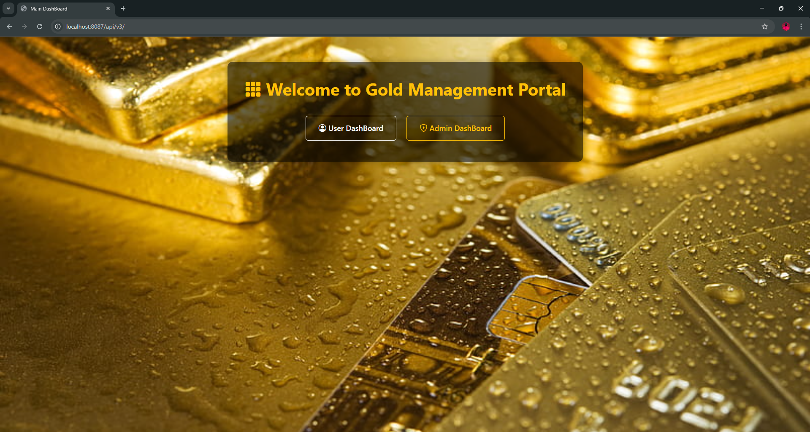
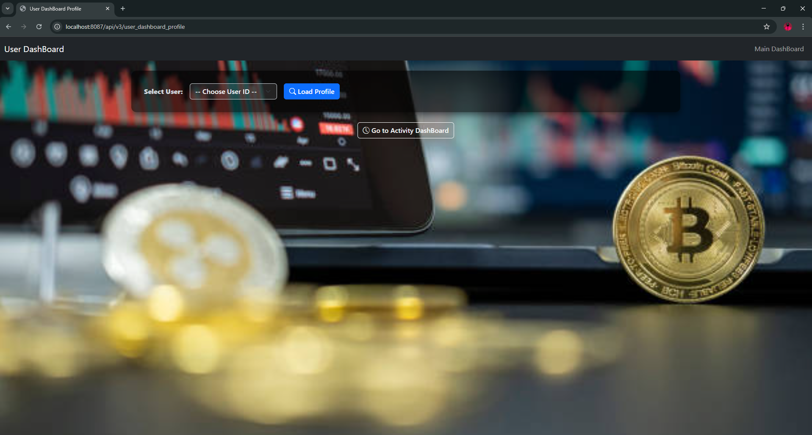
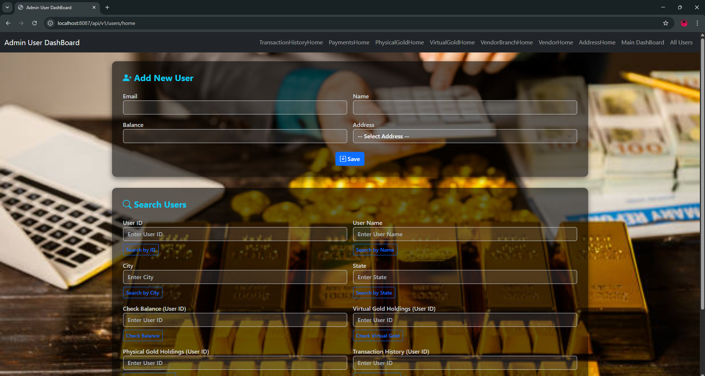
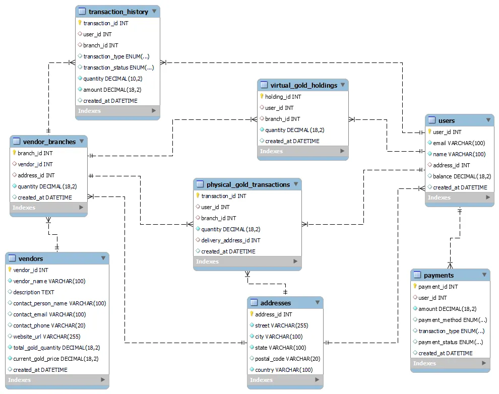

# 🏦 GoldWallet Monolith Web Application

A complete Spring Boot monolith web application for managing digital gold transactions, built using Spring MVC with Thymeleaf for the UI layer.  
This README provides detailed instructions to run the project, set up the database, understand the module structure, validations, exception handling, Docker/Kubernetes deployment, and outlines future upgrade plans.

> **Note:** This application is currently monolithic — future work will convert each entity into a separate microservice for scalability and flexibility.

---

## 📑 Table of Contents

1. [Project Overview](#-project-overview)
2. [Technology Stack](#-technology-stack)
3. [Screenshots](#️-screenshots)
4. [Project Structure](#-project-structure)
5. [Application Configuration](#-application-configuration)
6. [Endpoints Overview](#-endpoints-overview)
7. [Validations](#-validations)
8. [Global Exception Handling](#-global-exception-handling)
9. [Thymeleaf Integration](#-thymeleaf-integration)
10. [Prerequisites](#-prerequisites)
11. [Docker & Kubernetes Deployment](#-docker--kubernetes-deployment)
12. [Run Instructions](#-run-instructions)
13. [Future Enhancements](#-future-enhancements)
14. [Contact](#-contact)

---

## 📌 Project Overview

GoldWallet Monolith Web Application provides a comprehensive platform to manage every aspect of digital gold holdings:

- **User Registration & Management:** Register, update, and manage user profiles.
- **Vendor Management:** Onboard and manage gold vendors.
- **Digital Gold Purchase, Sale, and Tracking:** Users can buy/sell digital gold, and their holdings are automatically tracked.
- **Transaction History & Reporting:** All gold transactions are recorded and can be reviewed in detailed reports.
- **Web-based UI:** Clean, responsive interface built with Thymeleaf templates for a modern user experience.

This project is ideal for learning or deploying a secure, enterprise-grade digital gold wallet solution, with a clear path for microservice migration.

---

## 💻 Technology Stack

- **Java 17:** Modern, robust, and secure Java runtime.
- **Spring Boot 3.x:** Powerful backend framework for rapid development.
- **Spring MVC:** Implements the Controller-Service-Repository pattern for clean separation of concerns.
- **Thymeleaf:** Server-side template engine for building dynamic HTML views.
- **MySQL:** Relational database system to persist all data securely.
- **Maven:** Automated dependency management and build lifecycle.
- **Bootstrap/CSS:** (If present in `static/`) Enables attractive and responsive web design.

---

## 🖼️ Screenshots

### GoldWalletApplication Main Page



### GoldWalletApplication User Home Page



### GoldWalletApplication Admin Home Page



### GoldWalletApplication ER Diagram



---

## 📂 Project Structure

The project follows a standard Maven structure for Spring Boot applications, designed for maintainability and clarity:

```
GoldWalletMonolithApplication/
 ├── src/
 │   ├── main/
 │   │   ├── java/com/...      # Controllers, Services, Repositories, Entities (domain logic)
 │   │   ├── resources/
 │   │   │   ├── static/       # CSS, JS, Images for UI styling
 │   │   │   ├── templates/    # Thymeleaf HTML templates for all web pages and forms
 │   │   │   └── application.properties # Main configuration file
 │   └── test/                 # Unit and integration tests
 ├── pom.xml                   # Maven dependencies and build configuration
 ├── Dockerfile (if present)   # For containerization
 └── README.md (this file)     # Complete project documentation
```

**Key Concepts:**

- **Controller:** Handles HTTP requests and delegates to services.
- **Service:** Contains business logic and orchestration.
- **Repository:** Interfaces with the database.
- **Entities:** Represent the data model.

---

## ⚙ Application Configuration

All configuration values are defined in `src/main/resources/application.properties`.  
These control the application's identity, port, database credentials, and persistence settings.

**Sample:**

```
spring.application.name=GoldWalletMonolithApplication
server.port=8087

spring.datasource.url=jdbc:mysql://localhost:3306/digitalgoldwallet
spring.datasource.username=root
spring.datasource.password=YOUR_PASSWORD

spring.jpa.hibernate.ddl-auto=update       # Creates/updates DB tables based on Entities
spring.jpa.show-sql=true                   # Logs SQL queries for easier debugging
spring.jpa.properties.hibernate.format_sql=true
```

**Tips:**

- Use strong passwords and restrict MySQL access for production.
- `ddl-auto=update` is convenient for dev, but use `validate` or migrations for production.

---

## 🌐 Endpoints Overview

The application exposes both RESTful and UI (MVC) endpoints, grouped by version and function.

**Base Paths:**

- Web (MVC + Thymeleaf): `/api/v1/...` or `/api/v3/...`

**Main Pages:**

- **Main Dashboard:** [http://localhost:8087/api/v3/](http://localhost:8087/api/v3/)
- **User Profile:** [http://localhost:8087/api/v3/user_dashboard_profile](http://localhost:8087/api/v3/user_dashboard_profile)
- **Admin Home:** [http://localhost:8087/api/v1/users/home](http://localhost:8087/api/v1/users/home)

**Functional Areas:**

- **User Management:** Add, edit, list, and delete users.
- **Vendor Management:** Full CRUD for vendors.
- **Gold Transactions:** Buy, sell, and view wallet balance.
- **Transaction History:** Browse and filter all transactions.
- **Dashboards:** See aggregated and user-specific data at a glance.

---

## ✅ Validations

The application leverages the **Spring Validation API** (`jakarta.validation`) to enforce data integrity and business rules on both forms and API requests.

**Common Validation Annotations:**

- `@NotNull`, `@NotBlank`: Ensure required fields are present.
- `@Size`: Restrict length of text fields.
- `@Email`: Validate proper email address format.
- `@Pattern`: Custom regex for field formats (e.g., phone numbers).

**Integration with Thymeleaf:**

- Validation errors are automatically passed to the view and surfaced using `${#fields.errors('fieldName')}` for a better user experience.

**Localization:**

- All validation messages can be customized and localized via `application.properties` or `messages.properties`.

---

## 🛡 Global Exception Handling

A robust global exception handler (`@ControllerAdvice`) centralizes error management for user-friendly and secure error responses.

**Custom Exceptions Handled:**

- `AddressException`
- `PaymentException`
- `PhysicalGoldTransactionException`
- `TransactionHistoryException`
- `UserException`
- `VendorBranchException`
- `VendorException`
- `VirtualGoldHoldingException`

**Validation Exceptions:**

- `MethodArgumentNotValidException`
- `ConstraintViolationException`

**Generic Handling:**

- Any uncaught exception returns a 500 Internal Server Error with a safe, generic message (protecting sensitive details).

---

## 🎨 Thymeleaf Integration

The UI is powered by Thymeleaf templates, enabling:

- **Seamless Form Handling:** All forms use `th:action`, `th:object`, and `@ModelAttribute` for easy data binding and validation error display.
- **Dynamic Data Rendering:** Use `${variableName}` to inject server-side data into HTML.
- **UI Organization:** All templates are in `src/main/resources/templates/`, and static assets (CSS/JS) are in `static/`.

---

## 📋 Prerequisites

To run and develop this project, ensure the following:

- **Java 17+**: Download from [Oracle](https://www.oracle.com/java/technologies/downloads/) or [Adoptium](https://adoptium.net/).
- **Maven 3.x**: [Download Maven](https://maven.apache.org/download.cgi) and add to PATH.
- **MySQL Server**: Create a database named `digitalgoldwallet`.
- **IDE:** Recommended: IntelliJ IDEA, Spring Tool Suite, or Eclipse.

---

## 🐳 Docker & Kubernetes Deployment

### Dockerfile

A Dockerfile is provided to build a lightweight container image for your application:

```dockerfile
FROM openjdk:17-jdk-slim
WORKDIR /app
COPY target/GoldWalletMonolithApplication.jar GoldWalletMonolithApplication.jar
EXPOSE 8087
ENTRYPOINT ["java", "-jar", "GoldWalletMonolithApplication.jar"]
```

### Build & Push Image

Build and push the Docker image to your Docker Hub account:

```bash
mvn clean package -DskipTests
docker build -t <your-dockerhub-username>/gold-wallet-image:0.0.1 .
docker push <your-dockerhub-username>/gold-wallet-image:0.0.1
```

Replace `<your-dockerhub-username>` with your actual Docker Hub username.

**Kubernetes (Deployment + Service)**  
The repo contains a Deployment YAML and Service YAML for the web app (example):

- `deployment.yaml` (replicas: 5, image: `<pramodhkumar3/gold-wallet-image>:<0.0.1>`, containerPort: 8087)
- `service.yaml` (type: LoadBalancer, port: 8090 -> targetPort 8087)

Apply to a cluster:

```bash
nano deployment.yaml
kubectl apply -f deployment.yaml
nano service.yaml
kubectl apply -f service.yaml
kubectl get deployment
kubectl get pods
kubectl get service
```

To exit from the VI editor use the below commands

```bash
Ctrl+O -> Enter -> Ctrl+X
```

1. Ctrl+O -> to escape form the editor
2. Enter
3. Ctrl+X -> to save and exit

**Deployment YAML:**

```yaml
apiVersion: apps/v1
kind: Deployment
metadata:
  name: gold-wallet-deployment
  labels:
    app: gold-wallet-app
spec:
  replicas: 5
  selector:
    matchLabels:
      app: gold-wallet-app
  template:
    metadata:
      labels:
        app: gold-wallet-app
    spec:
      containers:
        - name: gold-wallet-cont
          image: pramodhkumar3/gold-wallet-image:0.0.1
          ports:
            - containerPort: 8087
```

**Service YAML:**

```yaml
apiVersion: v1
kind: Service
metadata:
  name: gold-wallet-service
spec:
  selector:
    app: gold-wallet-app
  ports:
    - protocol: TCP
      port: 8090
      targetPort: 8087
  type: LoadBalancer
```

---

**Usage Notes:**

- Update the Docker image name if you use your own Docker Hub.
- The deployment runs 5 replicas for high availability.
- The service exposes the app on port 8090 (forwarded to 8087 in the pods).

---

## ▶ Run Instructions

You can run the application either from your IDE or command line.

### Method 1 — From Spring Tool Suite (STS) or IDE

**Import Project:**

1. Open your IDE.
2. File → Import → Existing Maven Projects.
3. Select the project folder.

**Update Maven Dependencies:**

- Right-click the project → Maven → Update Project.

**Run the Application:**

- Right-click `GoldWalletMonolithApplication.java`.
- Select Run As → Spring Boot App.

**Access the Application:**

- Open your browser and go to: [http://localhost:8087/api/v3/](http://localhost:8087/api/v3/)

---

### Method 2 — From Command Line (CMD)

```bash
# Navigate to the project directory
cd GoldWalletMonolithApplication

# Clean and package the application (skip tests if desired)
mvn clean package -DskipTests

# Run the generated JAR
java -jar target/GoldWalletMonolithApplication-0.0.1-SNAPSHOT.jar
```

**Access the app at:**  
[http://localhost:8087/api/v3/](http://localhost:8087/api/v3/)

---

## 🚀 Future Enhancements

To keep pace with best practices and scalability, consider the following improvements:

### Entity-Based Microservices Architecture

- Migrate each major entity (User, Vendor, Transaction, Wallet, etc.) into its own microservice.
- Enables independent deployment, scaling, and technology upgrades.

### Role-Based Access Control

- Implement authentication and authorization for Admin, Vendor, and User dashboards, with fine-grained permissions.

### Real-Time Gold Price Updates

- Integrate with a live gold price API to provide up-to-date prices for transactions.

### Enhanced Reporting

- Add features to generate and download transaction statements in PDF/Excel formats.

---

## 📬 Contact

Created with 💻 by [Pramodh Kumar](www.linkedin.com/in/tamminaina-pramodh-kumar-6433a4242)

For questions, feedback, or contributions, please open an issue or contact directly.
